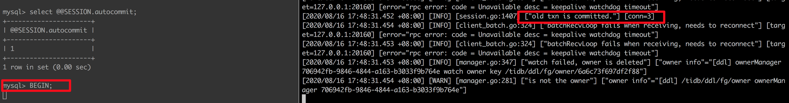

<!-- START doctoc generated TOC please keep comment here to allow auto update -->
<!-- DON'T EDIT THIS SECTION, INSTEAD RE-RUN doctoc TO UPDATE -->
**Table of Contents**  *generated with [DocToc](https://github.com/thlorenz/doctoc)*

- [如何编译构建 TiDB 集群，并运行起最小示例](#如何编译构建-tidb-集群并运行起最小示例)
  - [步骤拆解](#步骤拆解)
  - [执行](#执行)
    - [环境 Hello World](#环境-hello-world)
    - [编译组件](#编译组件)
      - [PD server 编译](#pd-server-编译)
      - [TiKV server 编译](#tikv-server-编译)
      - [TiDB server 编译](#tidb-server-编译)
    - [修改事务声明代码](#修改事务声明代码)
  - [后验总结](#后验总结)
    - [分布式事务相关](#分布式事务相关)
    - [疑问](#疑问)

<!-- END doctoc generated TOC please keep comment here to allow auto update -->

# 如何编译构建 TiDB 集群，并运行起最小示例

任务话题很有趣，作为一个有着一定开发经验的开发人员，如何在一次都没玩过 TiDB 的基础上能够快速编译一个 TiDB 集群，并使得 TiDB 运行事务时输出一个 "hello transaction" 的日志.


## 步骤拆解
TiDB 的生态和文档建设已经十分丰富，相信像是部署这种文档是肯定完备的。秉承着从简单开始的原则，我们的第一步是在单机搭建起一个 TiDB 集群。

从介绍材料内我们可以了解跑起一个最简单的 TiDB 集群需要三个组件：TiDB，PD 和 TiKV，那么从用户角度来讲，部署文档肯定会位于最上层组件，则去 TiDB 的 git 内找寻文档效率应该是最高的。

从任务描述来看，要完成我们做的事情：
1. 编译 tidb，tikv，pd 模块
2. 跑起三个模块，排除过程中遇到的困难，熟悉三个模块各自在工作时候的日志模式，以及观察 CPU，内存等占用情况
3. 进一步搞清楚什么叫 "TiDB 运行事务时"，最直白的理解，需要起一个事务 sql 语句请求 tidb，观察各个组件日志情况
4. 在请求入口处插入日志列即可

我们还拥有一个利器：[问答社区](https://asktug.com/c/developer/developer-qa)

## 执行
### 环境 Hello World
在 TiDB 内，我们从首页被引导到 [quick start](https://docs.pingcap.com/zh/tidb/stable/quick-start-with-tidb)，可以在其中发现 TiUP 这个工具可以帮助我们快速体验日志。

在快速启动中，引导只有 TiUP 和容器部署两种工具，没有手动部署，这点不利于我们自己动手，因为 TiUP 一看就是下载已经编译好的东西，第一步我们可以尝试，使用 TiUP 部署后，观察启动的进程位置等情况，来决定下一步能替换哪些东西可以快速的自己替换库的版本。

根据官方说明，使用 TiUP 启动环境后，会有一个后台进程显示启动成功，以及对应的监控地址，无奈的是一个是 grafana 监控和 dashboard 监控全都因为密码问题无法登陆，可以回头参与 tidb 内优化一下。

使用 htop 观察进程，可以看到如下的进程结构，得到想要的信息
```shell
/Users/liuyi/.tiup/components/pd/v4.0.4/pd-server --name=pd-0 --data-dir=/Users/liuyi/.tiup/data/S7SS4aM/pd-0/data --peer-urls=http://127.0.0.1:2380 --advertise-peer-urls=http://127.0.0.1:2380 --client-urls=http://127.0.0.1:2379 --advertise-client-urls=http://127.0.0.1:2379 --log-file=/Users/liuyi/.tiup/data/S7SS4aM/pd-0/pd.log --initial-cluster=pd-0=http://127.0.0.1:2380
```
从官方的 tiup 启动的环境有 pd-server, grafana-server 和 prometheus，似乎并没有我们想要的 tidb 和 tikv 组件。使用 mysql 连接不通也能印证我们的思路。
```
mysql --host 127.0.0.1 --port 4000 -u root
ERROR 2003 (HY000): Can't connect to MySQL server on '127.0.0.1' (61)
```
我们从进程信息了解到所有的数据都被放在了 ~/.tiup 下，所以可以去目录观察一下，从 components 目录下可以找到组件，观察后发现启动不了的原因：v4.0.4

换用 v4.0.0 的镜像后所有服务正常启动，花一点心思就可以找到对应的目录位置：本机的 data 目录，或者使用 [Dashboard Search Logs](http://127.0.0.1:2379/dashboard/#/search_logs/detail/1)

我们期望在 tidb 层加入日志，则可以多注意观察 tidb 的日志和 tidb 编译目录内容.
通过观察日志，我们在整个 .tiup 搜索 tidb 的配置项，发现没有匹配位置，所以我们可以推测，对应的配置是由 tiup **自动生成**的，如果需要配置，也是由 tiup 参数等控制了，从这里了解不到更多编译的细节，但是我们得到了一个能快速启动的脚本，以及知道了所有组件的二进制项目位置，那么我们就可以自己编译然后替换二进制了，顺便熟悉一下 tiup 的[文档](https://docs.pingcap.com/zh/tidb/stable/tiup-documentation-guide)。

快速启动 tidb 集群的命令行
```
tiup playground v4.0.0 --db 1 --pd 1 --kv 3 --monitor
tiup playground cleanup
```

### 编译组件

组件启动顺序为 pd->tikv->tidb, 非常好理解, 先启动 manager 组件掌控全局, 再启动实际存储把工人准备好, 最后启动 sql server 开始接客.

所以我们可以按照顺序替换自己的编译版本, 每次都用 tiup 重启集群确认情况.
为了学习的稳定，我们使用所有的分支为 4.0.0 的 tag 拉出来的分支.

#### PD server 编译
下载 pd 源代码后即可正常编译，执行命令。
```
git branch -b 4.0 origin/release-4.0
git checkout 4.0
make -j8
```

#### TiKV server 编译
下载 tikv 源代码后正常编译，执行命令。
```
git checkout tags/v4.0.0 -b 4.0
make -j8
```
注意因为 tikv 目录下有一个 rust-toolchain 文件，所以第一次执行的时候会使用指定 rust 版本，因为一般情况下机器上没有安装，所以会先安装一次，但是因为日志被接管，所以现象是 make -j8 一段时间会一直没有任何输出，耐心等待第一次就好。
细节可以参考 rustup 的文档关于 [rust-toolchain](https://github.com/rust-lang/rustup#the-toolchain-file) 文件的相关内容。

#### TiDB server 编译
tidb 的文档首页没有直接编译的引导，需要自己扒拉一下 docs 目录找一下资料, 在[快速开始](https://github.com/pingcap/tidb/blob/master/docs/QUICKSTART.md) 内可以找到编译的指令.。
在我的机器上遇到的问题:
```
# command-line-arguments
flag provided but not defined: -L/usr/local/opt/llvm/lib
usage: link [options] main.o
CGO_ENABLED=1 GO111MODULE=on go build  -tags codes  -ldflags '-L/usr/local/opt/llvm/lib -X "github.com/pingcap/parser/mysql.TiDBReleaseVersion=v4.0.0-beta.2-948-g148f2d456" -X "github.com/pingcap/tidb/util/versioninfo.TiDBBuildTS=2020-08-15 01:43:52" -X "github.com/pingcap/tidb/util/versioninfo.TiDBGitHash=148f2d456bdc531bb212028f8499ece141e20401" -X "github.com/pingcap/tidb/util/versioninfo.TiDBGitBranch=master" -X "github.com/pingcap/tidb/util/versioninfo.TiDBEdition=Community" ' -o bin/tidb-server tidb-server/main.go
```

简单确认了 Makefile 内没有加入这个 flags，后确认是我原来的配置自带了，删除这个配置即可正确编译。

执行编译命令
```
git checkout tags/v4.0.0 -b 4.0
make -j8
```

### 修改事务声明代码
从理论上分析，TiKV 本身是一个分布式一致性 db，并且有 MVCC 和事务抽象，则向上应该提供了
简单的事务提交接口供无状态的 sql server 调用，我们只需要找到那个位置即可，在这一步应该忽略具体事务的实现，先专注找到调用事务的位置，集中位置应该是 tidb 项目目录内，同时我们也应该意识到，我们每次为了验证维护稳定，只需要 tiup 内替换 tidb-server 即可。

最新的启动命令
```
tiup playground v4.0.0 --db 1 --pd 1 --kv 3 --tiflash 0 --monitor --db.binpath [your bin path]
```
我们使用下列的 tidb transaction 语句，并观察日志。参考了[这篇文档](https://docs.pingcap.com/zh/tidb/stable/transaction-overview)。
```sql
set autocommit = 0;
CREATE TABLE T (I INT KEY);
INSERT INTO T VALUES (1);
BEGIN;
INSERT INTO T VALUES (1); -- MySQL 返回错误；TiDB 返回成功
INSERT INTO T VALUES (2);
COMMIT; -- MySQL 提交成功；TiDB 返回错误，事务回滚
SELECT * FROM T; -- MySQL 返回 1 2；TiDB 返回 1
```

一开始执行的时候发现，提交后表现和文档内所展示的不太一样，比如 insert 1 后会立刻报错。仔细阅读文档后发现这篇的功能前提都基于乐观锁模型，而在后面的乐观事务文档内写到最新版本的数据会默认开启悲观事务模型。（文档可以改进）

在我们的目标内，我们其实是希望找到 BEGIN 语句的执行流程, 用哪种模型暂时和目标无关，应该选择能产生更多日志的链路方便抓到更多线索，理论上看悲观模型更合适。

在 tidb 内的日志中，观察到比较重要的相关日志：
```
[2020/08/16 14:23:34.728 +08:00] [INFO] [session.go:1413] ["NewTxn() inside a transaction auto commit"] [conn=3] [schemaVersion=24] [txnStartTS=418790497694253057]
[2020/08/16 14:24:32.659 +08:00] [ERROR] [conn.go:728] ["command dispatched failed"] [conn=3] [connInfo="id:3, addr:127.0.0.1:50011 status:1, collation:utf8mb4_0900_ai_ci, user:root"] [command=Query] [status="inTxn:1, autocommit:0"] [sql="INSERT INTO T VALUES (1)"] [txn_mode=PESSIMISTIC] [err="[kv:1062]Duplicate entry '1' for key 'PRIMARY'"]
```

提示我们 session.go 和 conn.go 内和执行流程相关的信息比较多, 可以重点看一下这两块的代码。

追溯代码中发现 session/txn.go 描述了事务结构，也比较重要。而且通过事务概述的文章可以得知，sql server 在执行事务的时候会把相关语句放在 sql server 本 session 的上下文内，则应该可以找到类似的代码。

查看代码后比较相关的代码感觉有如下：
```go
// session.go  
func (s *session) PrepareTxnCtx(ctx context.Context) {...}
func (s *session) NewTxn(ctx context.Context) error {...}
```

在两处起点添加日志代码后重新编译 tidb 并执行语句观察日志.
```
[2020/08/16 15:25:38.906 +08:00] [INFO] [session.go:2123] ["CRUCIAL OPERATION"] [conn=3] [schemaVersion=22] [cur_db=test] [sql="CREATE TABLE T (I INT KEY)"] [user=root@127.0.0.1]
[2020/08/16 15:25:38.906 +08:00] [INFO] [session.go:1406] ["hello transaction for NewTXN"] [conn=3]
[2020/08/16 15:25:38.911 +08:00] [INFO] [ddl_worker.go:253] ["[ddl] add DDL jobs"] ["batch count"=1] [jobs="ID:46, Type:create table, State:none, SchemaState:none, SchemaID:1, TableID:45, RowCount:0, ArgLen:1, start time: 2020-08-16 15:25:38.903 +0800 CST, Err:<nil>, ErrCount:0, SnapshotVersion:0; "]
[2020/08/16 15:25:38.911 +08:00] [INFO] [ddl.go:500] ["[ddl] start DDL job"] [job="ID:46, Type:create table, State:none, SchemaState:none, SchemaID:1, TableID:45, RowCount:0, ArgLen:1, start time: 2020-08-16 15:25:38.903 +0800 CST, Err:<nil>, ErrCount:0, SnapshotVersion:0"] [query="CREATE TABLE T (I INT KEY)"]
[2020/08/16 15:25:38.913 +08:00] [INFO] [ddl_worker.go:568] ["[ddl] run DDL job"] [worker="worker 3, tp general"] [job="ID:46, Type:create table, State:none, SchemaState:none, SchemaID:1, TableID:45, RowCount:0, ArgLen:0, start time: 2020-08-16 15:25:38.903 +0800 CST, Err:<nil>, ErrCount:0, SnapshotVersion:0"]
[2020/08/16 15:25:38.914 +08:00] [INFO] [session.go:2032] ["hello transaction for PrepareTxnCtx"]
[2020/08/16 15:25:38.914 +08:00] [INFO] [session.go:2032] ["hello transaction for PrepareTxnCtx"]
[2020/08/16 15:25:38.914 +08:00] [INFO] [session.go:2032] ["hello transaction for PrepareTxnCtx"]
[2020/08/16 15:25:38.915 +08:00] [INFO] [session.go:2032] ["hello transaction for PrepareTxnCtx"]
```

追踪日志看到 PrepareTxnCtx 在很多位置都调用到，应该加的位置不对产生很多噪音日志，后面的是对的，重新来一次（执行上述语句序列）。

只有在第一句执行语句的时候才会出现，不符合预期。
```
[2020/08/16 15:50:03.110 +08:00] [INFO] [session.go:1406] ["hello transaction for NewTXN"] [conn=3]
```

对整体流程的执行还是有点误解，再梳理一次代码。
逻辑流程上，每一个语句会被默认当作事务提交，因为 autocommit=1，如果使用 begin / commit 则会关闭自动提交并提交上一次的语句，并只能在 commit 时候隐式提交下一次的语句。

context.go 内定义了 session 作为 Context interface 的所有接口动作，从这里比较容易看出 session 一个生命周期拥有的动作。
client connection 和 session 的连接层次关系：
cliConn -> QueryCtx -> SessionVars() -> session -> sessionVars -> txnCxt

事务应该是以每个 txn(transaction 的缩写吧?) 为上下文的，所以应该在 txn 本身的产生和注销的位置打日志比较容易观察整个流程.
使用 vscode 可以直接 attach 到 tidb-server 的进程，也可以帮助验证。

最后在这里加入代码可以在日志内找到.

```go
func (s *session) NewTxn(ctx context.Context) error {
	if s.txn.Valid() {
		txnID := s.txn.StartTS()
		logutil.Logger(ctx).Info("old txn is committed.")
		err := s.CommitTxn(ctx)
		if err != nil {
			return err
		}
```
结果


## 后验总结

### 分布式事务相关
在分析修改代码位置的时候，我们不可避免的要从逻辑上想明白要改的代码位于什么位置，并针对性的搜索材料，因为 tidb 的文档和社区教程做的很不错，我们可以找到很多文档辅助我们更快完成工作，罗列一下在执行过程中参考的资料

[总体架构概述](https://pingcap.com/blog-cn/how-do-we-build-tidb/)

[计算模型概述](https://pingcap.com/blog-cn/tidb-internal-2/)

[事务概述](https://docs.pingcap.com/zh/tidb/stable/transaction-overview)

### 疑问
在执行下列语句时，表现不太符合预期
```sql
CREATE TABLE T (I INT KEY);
INSERT INTO T VALUES (1);
BEGIN OPTIMISTIC;
INSERT INTO T VALUES (1);  -- 此行会立刻报错, 乐观锁应该是 commit 时候报错.
COMMIT;
```

而且操作过程中，有时候 begin； 执行会有 NewTxn 的日志，有时候就什么都没有，这应该和事务模型本身以及 auto commit 有关系，但是暂时还没有搞的特别清楚。