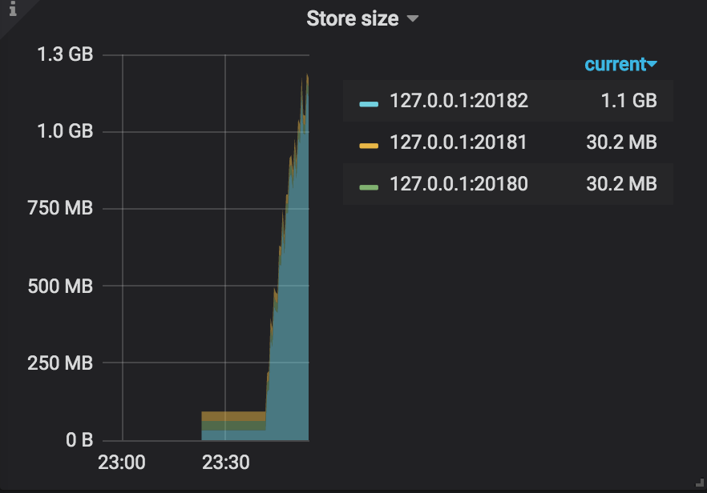
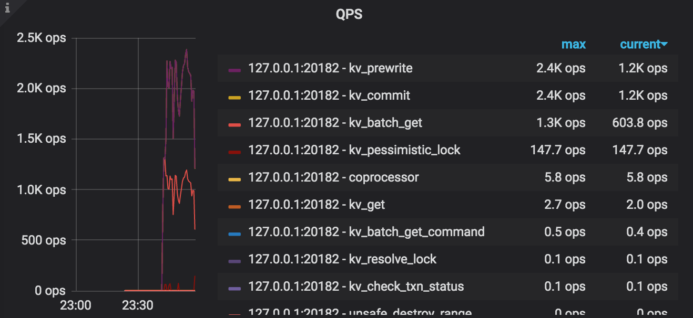
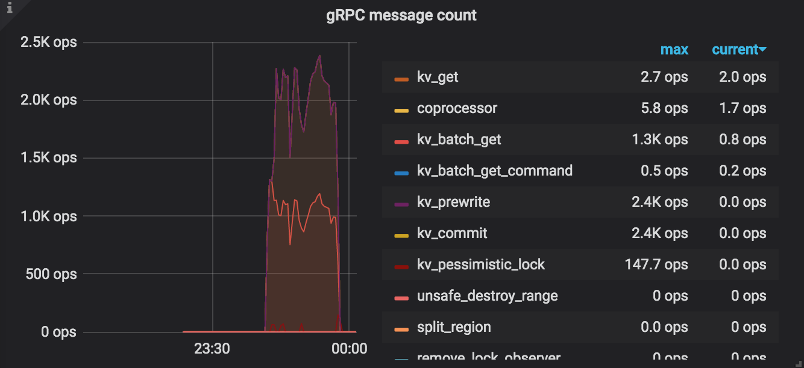
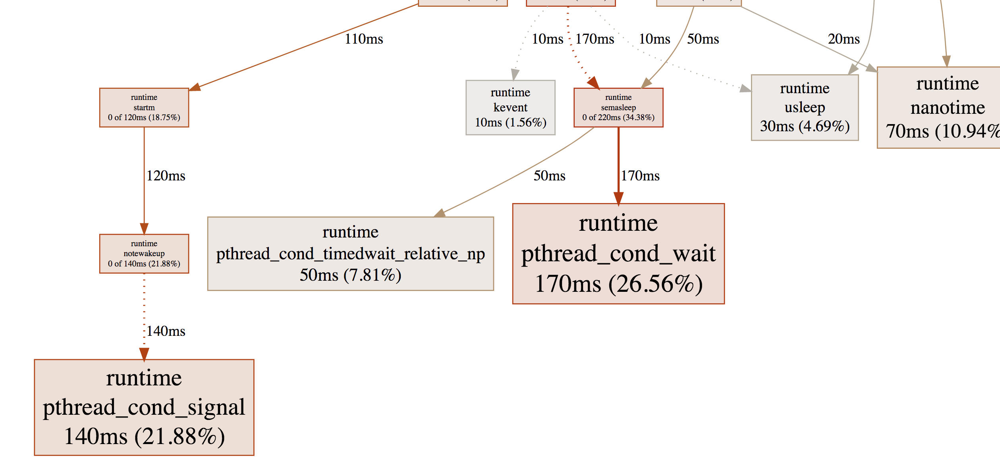
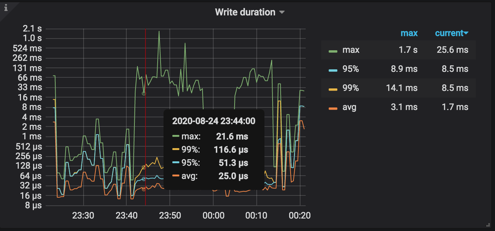

<!-- START doctoc generated TOC please keep comment here to allow auto update -->
<!-- DON'T EDIT THIS SECTION, INSTEAD RE-RUN doctoc TO UPDATE -->
**Table of Contents**  *generated with [DocToc](https://github.com/thlorenz/doctoc)*

- [Benchmark TiDB](#benchmark-tidb)
  - [步骤拆解](#步骤拆解)
  - [本机测试 TiDB Cluster](#本机测试-tidb-cluster)
    - [启动集群](#启动集群)
    - [Sysbench 测试](#sysbench-测试)
    - [go-ycsb 测试](#go-ycsb-测试)
  - [集群测试 TiDB](#集群测试-tidb)

<!-- END doctoc generated TOC please keep comment here to allow auto update -->

# Benchmark TiDB
## 步骤拆解
基于个人穷，找不到那么多机器，工作可以分两部分完成。
首先，在自己的 mac 开发机上试着运行一个最小化模拟生产环境 cluster，并执行 benchmark，先把流程走通，然后偷偷跑到公司环境找几台机器看看能不能跑一下集群（主要是端口受限，可能不好挂代理）

## 本机测试 TiDB Cluster

### 启动集群
我们复用第一节的命令直接启动本地测试集群
```sql
tiup playground v4.0.0 --db 1 --pd 1 --kv 3 --tiflash 0 --monitor
```

### Sysbench 测试
mac 上首先安装 sysbench
```sh
brew install sysbench
```

参考教程编辑配置文件
```
mysql-host=127.0.0.1
mysql-port=4000
mysql-user=root
mysql-password=
mysql-db=sbtest
time=600000
threads=4
report-interval=10
db-driver=mysql
```

跑前准备工作
```sql
create database sbtest;
# 开启乐观模式
set global tidb_disable_txn_auto_retry=off;
set global tidb_txn_mode="optimistic";
```

这里的问题是似乎和官方文档的设置方法不同，这个可以 work，之后可以优先用这个。


### go-ycsb 测试
安装比较简单
```sh
git clone git@github.com:pingcap/go-ycsb.git
cd go-ycsb/
make -j8
```

运行命令，第一条加载数据，第二条测试性能
```sh
./bin/go-ycsb load mysql -P workloads/workloada -p recordcount=1000000 -p mysql.host=127.0.0.1 -p mysql.port=4000 --threads 4
./bin/go-ycsb run mysql -P workloads/workloada -p operationcount=1000000 -p mysql.host=127.0.0.1 -p mysql.port=4000 --threads 4
```

执行日志(单机果然慢...)
```
# 插入
...
INSERT - Takes(s): 948.4, Count: 1000000, OPS: 1054.5, Avg(us): 3717, Min(us): 1761, Max(us): 1834116, 99th(us): 14000, 99.9th(us): 57000, 99.99th(us): 250000
```
插入过程中的关键截图: 



发现 Tikv 的一个执行特性：对同一个机器上的副本不执行写入，因为没意义。

然后执行查询操作
```
READ   - Takes(s): 524.5, Count: 500111, OPS: 953.5, Avg(us): 1073, Min(us): 557, Max(us): 469768, 99th(us): 3000, 99.9th(us): 6000, 99.99th(us): 12000
UPDATE - Takes(s): 524.5, Count: 499889, OPS: 953.0, Avg(us): 3093, Min(us): 540, Max(us): 1544214, 99th(us): 10000, 99.9th(us): 177000, 99.99th(us): 257000
```

对 tidb 做 profiling，观察结果


发现最大块的时间来源是 pthread，证明其花在等待 Tikv 上的时间占比比较大。

观察 grafana 内的 Tikv 数据曲线，因为读的时间在 1ms，写的时间在 3ms，结合 mac 的机器，查看 RocksDB 的写入统计


<font color='red'>瓶颈分析</font>：在 workloada 下，单机磁盘的 update 可能是最大的瓶颈。

最后观察并总结了一下 workloada-f 的区别

## 集群测试 TiDB
没找到机器，暂时作罢。。。
